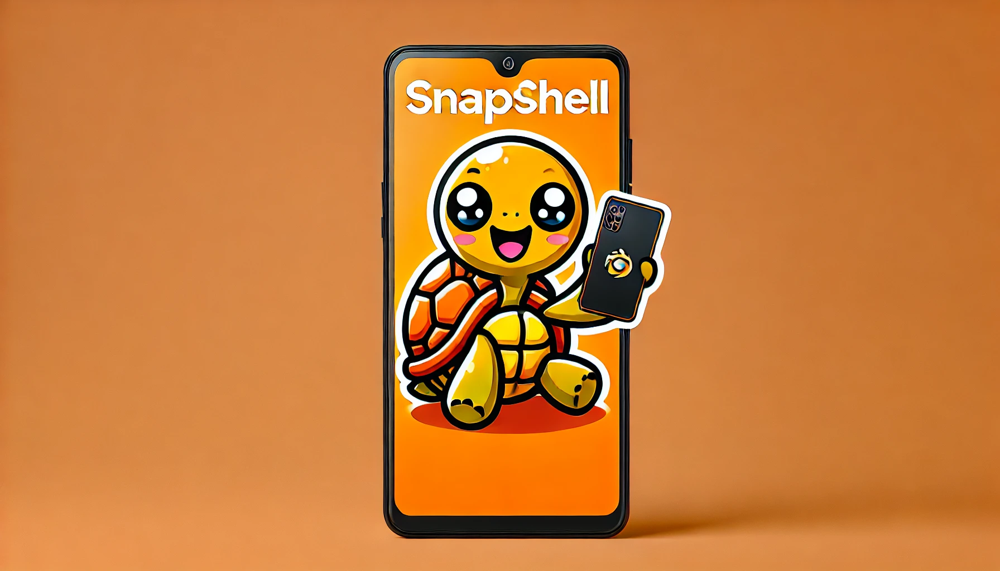

# SnapShell

**SnapShell** is a modern e-commerce platform specializing in customized phone cases, designed to provide a personalized shopping experience for smartphone enthusiasts. Built with cutting-edge technology including React, Next.js, and TypeScript, SnapShell offers a seamless and intuitive interface for users to create and purchase their perfect phone case.

Visit us at: [SnapShell](https://snap-shell.vercel.app/)

## Features

- 🛠️ Complete shop built from scratch in Next.js 14
- 💻 Beautiful landing page included
- 🎨 Custom artworks made by a professional illustrator
- 💳 Secret admin dashboard to manage orders
- 🖥️ Drag-and-drop file uploads
- 🛍️ Customers can purchase directly from you
- 🌟 Clean, modern UI on top of shadcn-ui
- 🛒 Completely custom phone case configurator
- 🔑 Authentication using Kinde
- ✉️ Beautiful thank-you email after purchase
- ✅ Apple-inspired configuration design
- ⌨️ 100% written in TypeScript
- 🎁 ...much more

## Technologies

SnapShell is built using the following technologies:
- **React**: A JavaScript library for building user interfaces.
- **Next.js**: A React framework for production.
- **TypeScript**: A typed superset of JavaScript that compiles to plain JavaScript.
- **Vercel**: Deployment and scaling with Vercel platform.

## Information on How to Run Locally
